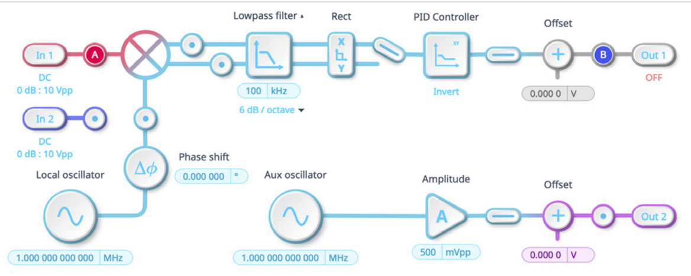
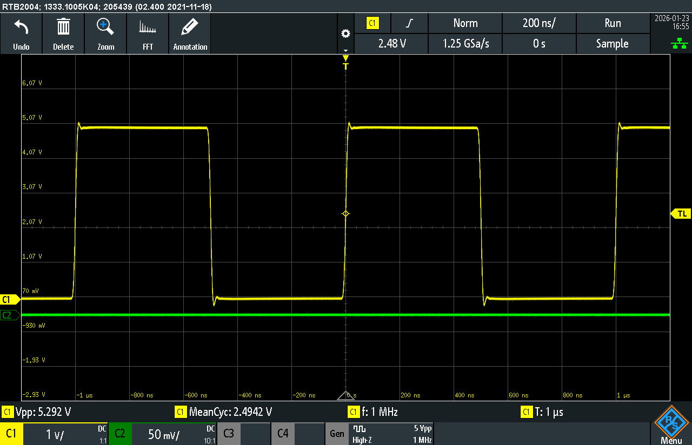
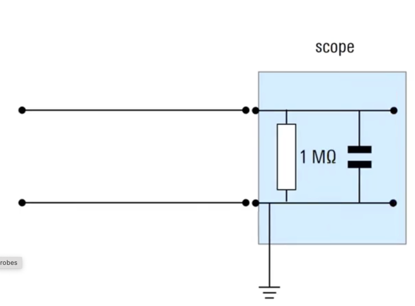
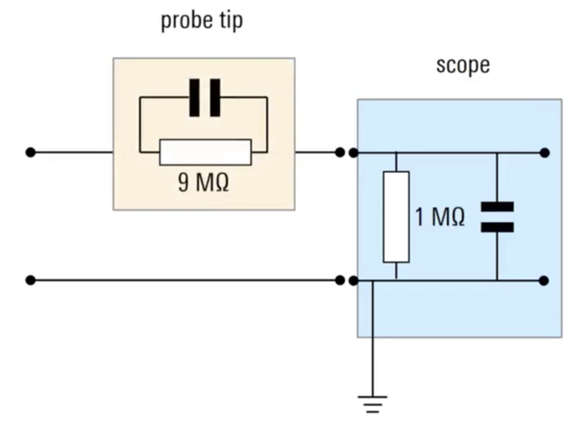

# Probes and Impedances

## a quick review of what probably already know about oscilloscopes 

An oscilloscope is a visual voltmeter. Like a handheld battery-operated multimeter, an oscilloscope can measure the electric potential difference $\Delta V$ — the `voltage` — between two different points in an electrical circuit.  The advantage of the oscilloscope over the handheld multimeter is that it can capture and visually display time-varying signal $\Delta V(t)$, and can do so up to very high frequency. If the signal repeats periodically, the oscilloscope can *trigger* off an identifying feature of the signal so as to keep that particular feature at the same point on the oscilloscope screen, thereby producing a synchronous display. 

Unlike a handheld multimeter, however, we are making a `single-ended measurement`, not a `differential measurement`. That is, to measure the voltage *across* a circuit element using the multimeter, we place the tip of the + probe of the voltmeter in contact with one side of the element and the tip of the - probe on the opposite side. Neither probe needs to be in contact with the point of the circuit designated as $V = 0$ — the `circuit ground` — to measure the differential voltage $\Delta V = V_+ - V_-$, and because the voltmeter does not have an explicit ground, it is said to be *floating*.   

The + tip of an oscilloscope probe is likewise placed in electrical contact with a point of interest for the circuit but the negative tip — often terminated in the form of a wire attached to a small aligator clip — is grounded, forcing $V_- = 0$.  The ground is made at the connection of the probe to the oscilloscope. This connection is usually a coaxial connector, with the inner wire corresponding to $ V_+$  and the outer locking connector corresponding to $V_-$. This {underline}`simplifies` the math — $\Delta V = {V_+ - V_-} = V_+ - 0 \equiv V(t)$ [^OneWireVoltmeters],  — but it {underline}`complicates` the measurement, because we have now made the oscilloscope part of the ground return for the electrical circuit! 

What is more, the oscilloscope inputs do not function as ideal voltmeters with infinite impedance.  To a function generator, a typical oscilloscope input looks like a 1 M$\Omega$ resistor in parallel with a small capacitor. This is typically in the range of 5 - 25 pf;  the input capacitance of an R&S RTB20204 oscilloscope is 19 $\pm$ 2 pf (in parallel with the 1 M$\Omega$ resistance). 

[^OneWireVoltmeters]: Alas, this prevalence of single-ended measurements for which $\Delta V(t) = V(t)$  has induced {underline}`confusion` in generations of *electrical engineers, who often graduate thinking a voltage measurement refers to a single point in a circuit (instead of being the potential difference between that point and ground). On their circuit diagrams, the ground wire (or ground plane) disappear (sometimes replaced by a ground point), oscillators, voltmeters, and oscilloscope channels have but one wire connected to the circuit, and power inputs (including grounds) for op amps disappear completely! 

       
       
       As *physicists*, we know better, but the mistake is understandable: if the oscilloscope ground is already connected to the circuit ground in some other way, you don't even need to connect the alligator clip serving as a ground reference wire to the circuit (and might even use a probe without one)! 
       
## exercises
### motivating exercise

{underline}`Instructions`: try this hands-on exercise before proceeding further. It illustrates the problems that can arise with high frequency signals (particularly square waves) and a common solution involving a 10:1 attenuation oscilloscope probe. You can use what you learn here to improve your measurement abilities in the follow on lab exercises and as background for the discussion that follows. 

::::{dropdown} Motivating Exercise: High frequency square waves
:open: 

How does the finite impedance of the oscilloscope input affect what is measured for a high frequency square wave? Can we correct for that? 

```{exercise} 
:label:ringdown
:class:dropdown


Configure a function generator to output a 1 MHz 0 to +5V square wave [^0_5V], then connect it to an input channel of your oscilloscope. Ignoring the transients for now, you should see a 5 Vpp square wave signal like that in the figure below. Compare it to a 1 kHz square wave, then switch back. 

:::{attention} Is your voltage measurement off by a factor of 2? 
:class: dropdown
Hey: If so, your function generator is probably set to 50 $\Omega$ or "low-Z" [^50_ohm] instead of  "high Z" [^high_Z].   The 50 $\Omega$ option assumes the function generator will be connected to a circuit or instrument with a 50 $\Omega$ impedance input; the high-Z option assumes it will be connected to a circuit or instrument with an infinite impedance through which no current flows (an ideal voltmeter). The input impedance of an oscilloscope is finite[^finite_impedance] rather than infinite but it is much closer to that of an ideal voltmeter than a 50 $\Omega$ resistor. Change output options[^output_options] and try again! 
:::


[^0_5V]: If using the internal function generator in an R&S RTB2004, select a 5 Vpp square wave then add a + 2.5V dc offset. 

[^high_Z]: function generators don't actually measure the amplitude of the output voltage. Instead, they assume you will connect the output to the input of an instrument (or circuit) with a known impedance. The most common assumption is infinite impedance ("high-Z"), but many modern function generators give you a 50 ohm option as well. Be sure to check! 

[^50_ohm]: Some instruments (e.g. photomultipliers) require that instruments connected to them (such as oscilloscopes or counter-timers) have a 50 ohm impedance. Setting the function generator to 50 ohm allows you to use it to simulate a photomultiplier (or similar instrument) but you still need the connection to your oscilloscope or counter-timer to terminate in  50 $\Omega$ impedance.  One way to do this is to connect a BNC  "tee" connector to the oscilloscope channel input, connect one of the two remaining inputs to the signal cable and the other to a 50 ohm "terminator". This puts the 1 M$\Omega$ impedance of the channel input in parallel with a 50 ohm resistor, effectively reducing the impedance seen by the signal source to 50 ohm. 

[^finite_impedance]:A typically oscilloscope input behaves as if it has a  1 Mohm resistor plus a small capacitance in parallel with the voltmeter input. In the low frequency limit, this corresponds to an impedance of 1 Mohm. This is much closer to infinity than it is to 50 ohms, so we should select "high-Z" as our option. At high frequency, the capacitance lowers the effective impedance. Can you think how we might correct for this? 

[^output_options]: If you are using the R&S RTB2004 internal function generator, you can see if the generator is set to 50 $\Omega$ or "high Z" by looking to the right of the `Gen` touchscreen button at the bottom of the display. 


Now take a closer look at the 1 MHz signal. Notice that at the higher frequency, the rising and falling voltages of the square wave are no longer instantaneous and there are brief oscillations following each voltage step. Because of these transient oscillations,  the measured peak-peak voltage is actually 5.29 V rather than 5.0. 





**Question**: If the resistance and capacitance across the oscilloscope voltage input are constant, why is the distortion of the square wave signal frequency dependent? 

Give yourself a couple of minutes to consider this question before looking at the hints. 


:::{hint} conceptual hint
:class: dropdown
When the function generator is connected to the finite impedance oscilloscope voltage input, the effective circuit looks like this.  In the low frequency limit, no current passes through the capacitor. What about in the high frequency limit? How does that change the effective impedance of the oscilloscope input? 

Check with your instructor to discuss your thinking before proceeding. 


:::

:::{hint} mathematical hint
:class: dropdown
The complex impedance $Z$ of this circuit is $\frac{1}{R} + \frac{1}{X_c } = R + i\ {2 \pi f C} $ , which simplifies to $\vert Z \vert = \frac{R}{\sqrt{1 + (2\pi f RC)^2}}$. 

How does this behave as a function of frequency? How might we modify the circuit (by adding a resistor and/or capacitor) to correct for this?

 Note: electrical engineers use *j* instead of *i* to represent $\sqrt{-1}$. 
 
 Check with your instructor to discuss your thinking before proceeding. 


:::

If you haven't already done so, check with your instructor to discuss your thinking before proceeding. 

```
````{solution} ringdown
:label: ringdown-solution
:class: dropdown


**Conceptual explanation**: 

By itself, the oscilloscope input connected to an oscillator forms a  RC circuit with the resistor and capacitor in parallel with the voltage source. 



If we add a 9 M$\Omega$ resistor in series with the 1 M$\Omega$ resistance of the voltage input, we will increase the input impedance at all frequencies, reducing current flow through the voltage input and bringing us closer to the zero current ideal. In the low frequency limit, this is a 10:1 voltage divider! 

But that leaves us with  a circuit that functions like a *frequency dependent* voltage divider. This is because as the signal frequency increases, the impedance of the capacitor decreases, effectively shorting high-frequency components to ground. 


We need a *frequency independent* voltage divider if we are to accurately infer the voltage output by the oscillator from the voltage measured across the oscilloscope input. 
That is, if the impedance of the RC circuit in the probe tip is 9 times the impedance of the RC circuit in the oscilloscope input, then the measured voltage across the probe input will always be 9 times less than that across the probe tip, and 10 times less than the voltage across the full voltage divider circuit. To do this, we add a small  capacitor in parallel with the 9 M$\Omega$ resistor in the probe tip. 



In fancier 10:1 passive probes, this is adjustable, but in the most basic probes, this is a fixed value. To compensate for the difference in input capacitances from one oscilloscope to another, we add an additional variable capacitor across the oscilloscope input. 

The resulting circuit diagram looks like this: 


**Mathematical explanation**: 
THe voltage imput behaves like an RC circuit. The impedance of this parallel RC circuit  is 
$$ Z_{input} =\left( \frac{1}{R} + \frac{1}{X_C}\right)^{-1}=  \frac{R_{input} X_{input}}{\sqrt{R_{input}^2 + X_{input}^2}} $$

where $R_{input}$ is the resistance across the voltage input, $X_{input} = \frac{1}{2\pi f C_{input}}$ is the frequency-dependent  reactance due to the capacitance across the input, and $Z$ is the resulting frequency dependent impedance across the input

If, however, we choose the proper values of R and C for the probe, we can make the ratio of the tip impedance to the input impedance a constant ratio. Choosing a ratio of 9:1 produces a convenient 10:1 reduction in measured voltage across the oscilloscope input (compared to the voltage output of the function generator). That is, we want 

$$ \frac{Z_{tip}}{Z_{input}} = \left(\frac{R_{tip} X_{tip}}{R_{input} X_{input}} \right) \sqrt{\frac{R_{input}^2 + X_{input}^2}{R_{tip}^2 + X_{tip}^2}} = 9$$

so that $\frac{V_{\textrm{oscillator output}}}{V_{\textrm{oscilloscope input}}} = 10$. 

For additional details and a more complete explanation, see [Secrets of the 10x passive probe](https://blog.teledynelecroy.com/2018/10/secrets-of-10x-passive-probe.html)

and 

The 10:1 passive voltage probe allows us to convert the oscilloscope into a frequency independent constant impedance voltage divider. 

````

::::

   
### measurement exercises

See the lab activities handout

# Going further

## how to make a differential voltage measurement with an oscilloscope 

To make a *differential measurement* across a circuit element for which neither end is at ground, you need a two channel oscilloscope — each channel is a single-ended voltmeter — and two independent voltage probes: connecting the + tip of the first  oscilloscope probe to one point of the circuit, the + tip of the second oscilloscope probe to another point of the circuit,  connect the first probe to channel 1, connect the second probe to channel 2, and then finally mathematically calculate the difference $V_2(t) - V_1(t)$. This is because connecting $V_-$ of an oscilloscope to a point on the circuit that isn't ground would immediately tie that point to oscilloscope ground, shorting the circuit and changing the voltage $\Delta V$ you wanted to make.  

Alternatively, you can connect the two probes to a differential amplifier to do the subtraction electronically, then connect its output to a single channel of the oscilloscope.  

Technically, it doesn't have to be an oscilloscope probe. It could just be a coax cable with a BNC coax connector on one end and two wires with alligator clips on the other. Functionally, this is the same as a `1x oscilloscope probe`. 

## measuring changes what is measured! 

A fundamental rule of experimental physics is that measuring changes what is measured. In quantum physics this is fundamental to our understanding of the Schrödinger wavefunction as a linear superposition of observable states, but it is no less true on a practical basis in a lab measuring the temperature of a superconducting transition with a platinum resistor, the lifetime of a muon undergoing radioactive decay inside a plastic scintillator, or the electric potential difference — the voltage! — between two points in an electronic circuit. 

Sending electrical current through a Pt resistive thermometer to measure its temperature dependent resistance warms the thermometer, inserting a plastic scintillator into the path of a passing negatively charged muon to detect the muon's arrival and decay changes how long the muon lasts,  and connecting the  finite 1 M$\Omega$ 35 pf oscilloscope input t to measure the time varying volage across a circuit element alters the shape and size of the signal that is measured! 

There is a difference of course — a quantum measurement typically changes the physical state of what you are measuring while a classical measurement typically does not induce a phase transition in a material (unless you are trying to — so our focus is usually on reducing these systematic errors to a level significantly smaller than the variation in signal we are seeking to measure. This is what textbooks and theorists refer to as an "ideal" measurement, one for which we can either ignore or correct for the influence of the measurement instrument on what we measure. 

The take-home message here is that real instruments differ from the conceptual ideal but  figuring out how to correct for those departures from ideal behavior is often the key to reducing systematic error, improving the overall accuracy of the result. Similarly, finding the sources of noise resulting from non-ideal behavior is often the key to improving the signal to noise ratio and in turn the overall precision of the result. 


