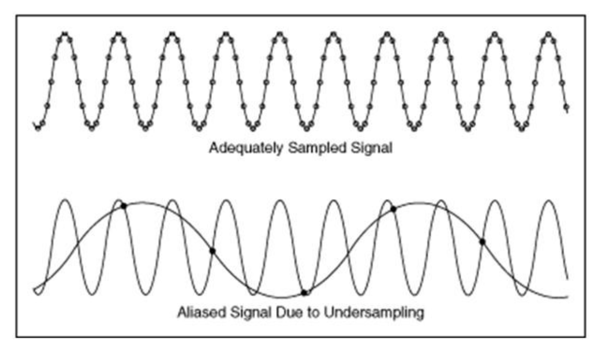
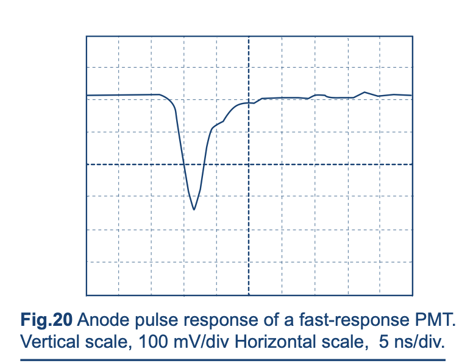

# Introduction

When you first turn on a digital storage oscilloscope, it will select the data sampling and triggering settings most commonly used to acquire a periodic signal. The number of voltage measurements made per acquistion interval is often a fixed rate, but this usually generates more data than can be stored in memory for one sweep of the signal across the screen.  

When you select a sampling mode, you select   the criteria by which the oscilloscope will choose which of the voltage measurements made during a particular interval should be kept in memory. The  continuous curve displayed on the oscilloscope screen is generated by using a mathematical function to interpolate[^interpolation_function]  between these data points the scope chooses to store in memory. The default sampling mode — typically called `sample` — retains one sampled point per acquisition interval, resulting in a constant time interval between consecutively sampled points. 

[^interpolation_function]: The two most common interpolation methods make use of either the $\sin(t)/t$ (sinc(t)) function  or  a linear function (resulting in straight lines between points). The best choice for 'bandwidth limited' sine waves is almost always the sinc function. This is because it acts like a low pass filter with an infinitely sharp  cutoff in frequency space — think Fourier transform—   resulting in a smoothly varying waveform without high frequency artifacts. It can, however, suppress sharp transients.  For this reason,  linear interpolation can be a better choice for pulse detection. The sinc function is the default setting for everything but the fastest scopes.   Keysight provides [a helpful comparison of the many different interpolation options](https://www.keysight.com/used/us/en/knowledge/glossary/oscilloscopes/what-are-interpolation-methods).  

When you select a triggering mode, you select the criteria the oscilloscope will use to refresh the display [^trigger_settings]. The default is AUTO and the alternative is NORM.  The difference is this: when set to NORM, the screen will only refresh if a particular feature is detected in the data. When set to AUTO, the screen will refresh after a set amount of time even if that feature is not detected. 

[^trigger_settings]: The selection of a *trigger mode* is different from choosing a particular trigger setting. When you specify a *trigger setting*, you specify the criteria the oscilloscope will use to identify a particular feature in the signal. The oscilloscope uses that setting to lock the waveform in place.  If properly triggering, the trigger light on your scope will light up each time the criteria is met and the selected feature will always occur at the sample place horizontally on the screen. A common starting point for a trigger setting  is to specify a point halfway between the signal minimum and maximum and to require the signal slope to be positive (known as a rising signal).

There isn't much to say about trigger modes:  your objective is to find a trigger setting that works, so choose the mode that gets you there! AUTO sometimes helps. If you start with AUTO, be sure to switch to NORM once you find a trigger setting that works. There is however a lot to say about sampling modes, because these actually change what is saved to memory and as a result what is shown on your display. Choose the wrong sampling mode for the task and you might never see what you're missing!  

The default sampling method — unsurprisingly named `sample`— retains one sampled point from each acquisition interval. The most commonly used alternative is usually named `peak` or `peak detect`.  Let's explore both.  


:::{dropdown} Discovery Exercise: event detection with an oscilloscope


```{exercise-start} 
:label: Motivating Exercise 1

Motivating Exercise text

```

```python
# Some code to explain the figure
```

and maybe you wish to add a figure


```{exercise-end}

```

:::


# Why This Matters

## you don't know what you are missing! 

Left to its own devices, a digital storage oscilloscope  (DSO) will miss features in your data. This is because the continuous signal shown on the oscilloscope display is actually an interpolated curve connecting voltage measurements taken at different points in time.  

```{figure} ./images/KeysightDigitizingScope.png
:label: fig-Digitized_Signal
:alt: A continuous signal is reconstructed from the digitally sampled data by interpolating between the points
:align: center

A digital store oscilloscope interpolates between voltage measurements made at discrete intervals in time. The data is stored in the oscilloscope's memory buffer. [Image source](https://www.keysight.com/blogs/en/tech/bench/2022/05/09/real-time-vs-sampling-oscilloscopes-what-are-the-differences)
```


The total number of data points your oscilloscope can store — its {underline}`storage buffer` — is limited, so if your oscilloscope is *triggering* off a periodic feature in your signal, the  time interval between sampled data points will increase as the time interval / division increases [^buffer_full]. 

For high frequency signals, this can make it appear that a periodic signal is lower frequency than it actually is, an artifact known as *aliasing*. If the apparent frequency of a sine wave changes when you change the time base, you know aliasing is occurring! For  pulses generated by short, discrete, random events (such as a cosmic muon passing through a plastic scintillator or a photon triggering a photomultiplier), an oscilloscope on autoset or auto triggering [^autotrigger]  might miss the event entirely! 

[^autotrigger]: Triggering an oscilloscope causes the display to refresh. NORMAL triggering mode will trigger the oscilloscope only when a defined event occurs (such as a rising voltage that crosses zero). AUTO triggering mode cause the screen to refresh at a regular interval even if the specified trigger event doesn't occur. AUTO is a good setting to start with for periodic signals but won't stay triggered if the signal is an intermittent transient. 

::::{tab-set}
:::{tab-item} Aliasing
:sync: Aliasing_tab
   
   
     
      

:::
:::{tab-item} Transients
:sync: Transient_tab
   
  
  [Image Source: www.photonis.com](https://psec.uchicago.edu/library/photomultipliers/Photonis_PMT_basics.pdf)
:::
::::


[^buffer_full]: This assumes the buffer is completely filled once per display cycle. But if it isn't, the oscilloscope either just can't sample fast enough or is sampling even less often than it could! 

## sampling and triggering options

The solution is to change how the data sampling and triggering is done. 

  


